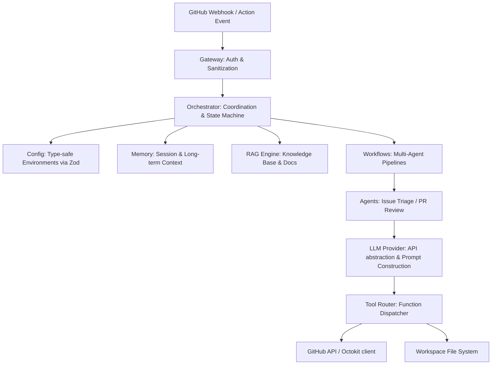

# Architecture & Modules Layout

This document defines the architectural patterns, runtime layers, module interactions, and file layout of the **OSS-Maintainer-AI** project.

## Execution Flow

## Dependency Inversion Principles

To ensure modularity and avoid circular dependencies:
1. **Core flows inward to Domain**: Modules like `core` or `shared` depend on type/domain descriptions defined in `domain/` and `types/`. The reverse is never true.
2. **Decoupled Integrations**: Independent client integrations (such as the GitHub service or LLM provider connections) do not depend on each other. If they need to communicate, they must use orchestrator callbacks or transfer parameters modeled within the shared domain context.

## Scalable Directory Plan

* **`src/domain/`**: Minimal domain types and objects representing core system resources (Issues, PullRequests, Repositories, Reviews, Contexts).
* **`src/types/`**: Common TS interfaces and structural utility types.
* **`src/config/`**: System configuration, environment variables, logger, and feature flags.
* **`src/core/`**: Orchestration logic and state machine coordinators.
* **`src/shared/`**: Common helper routines and shared utility libraries.
