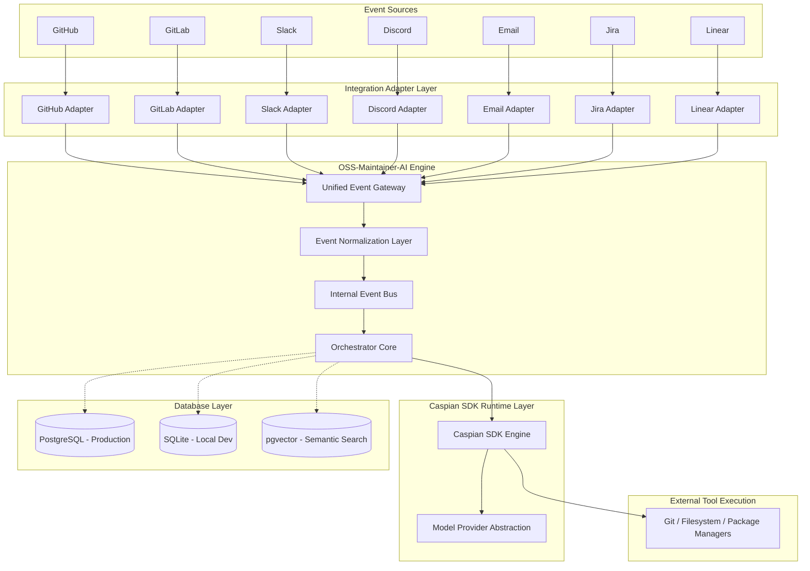
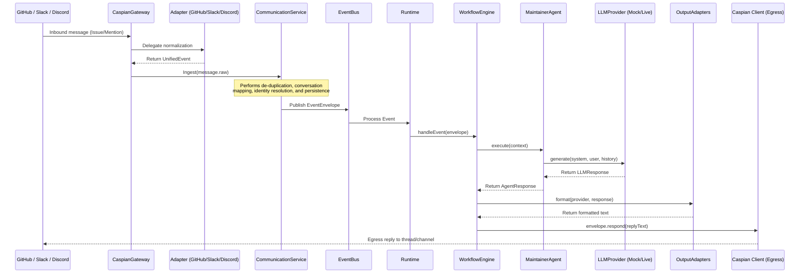

# OSS-Maintainer-AI

An autonomous, multi-platform AI co-maintainer built on top of the **Caspian SDK**.

---

## ⚡ Quick Start (5-Minute Zero-Config Demo)

Run a complete multi-channel agent execution loop locally without requiring any API keys:

```bash
# 1. Install dependencies
pnpm install

# 2. Copy the environment variables example
cp .env.example .env

# 3. Run the zero-config offline demo
pnpm demo
```

To run individual provider mocks:
- `pnpm demo:github` — replays a GitHub Issue thread.
- `pnpm demo:slack` — replays a Slack Mention thread.

---

## 🚀 Executive Summary (1-Minute Read)

### The Problem
Open-source maintainers face severe burnout. Triaging issues, responding to repetitive queries, and managing onboarding friction across multiple fragmented channels (Slack, Discord, GitHub, Email) eats up hours of productive coding time.

### The Solution: OSS-Maintainer-AI
OSS-Maintainer-AI is a platform-independent, context-aware co-maintainer agent that unifies these channels into a single execution stream. It acts as an automated assistant to maintain conversations, triage bug reports, and answer questions.

### Why Caspian Matters
Caspian acts as the unified communication backbone of the system. Instead of writing, configuring, and securing custom API clients, webhooks, signature verification logic, and polling loops for 10 different platforms, we write **one adapter per channel** that translates to/from Caspian format. Caspian coordinates real-time tunnels automatically.

### Why This is Different from a Normal Chatbot
Traditional chatbots are hardcoded to a specific chat API (e.g., Slackbot SDK) and lack unified cross-channel identity and context. OSS-Maintainer-AI unifies identity and context under a single database actor model:
* If you tell the bot your name on Slack, it remembers it when you message it on Discord.
* If you define custom variables (`x = 5`) on one channel, the context carries over to all other channels in real-time.

---

## 🖥️ Live Demo

The project currently supports and has been demonstrated live on the following channels:
* **Slack**
* **Discord**

Both platforms are connected **simultaneously** through Caspian and share:
* **One Communication Layer** to normalize message routing
* **One UnifiedEvent model** representing any incoming platform action
* **One Conversation Service** to manage and track thread sessions
* **One Identity Service** to merge cross-platform usernames into a single actor record
* **One Maintainer Agent** responding with consistent instructions
* **One memory/context pipeline** resolving cross-channel thread history

> [!NOTE]
> The screenshots in this repository demonstrate the exact same running maintainer agent instance responding on both Slack and Discord, recalling variables and context across platforms.


---

## 🔌 How Caspian Fits

Caspian is **not** simply another SDK dependency. It is the communication backbone that abstracts away the infrastructure of supported messaging platforms.

Instead of writing platform-specific ingress webhooks and client libraries, the flow unifies immediately:

```
Slack/Discord
     ↓
  Caspian
     ↓
Communication Layer
     ↓
  UnifiedEvent
     ↓
Maintainer Agent
```

This structural separation ensures that platform-specific API quirks, payload differences, and signature validation details are isolated at the edge, keeping the core agent logic entirely clean.

---

## 🐙 GitHub Integration Strategy

In a production environment, GitHub integration operates alongside real-time chat channels to form a unified maintenance suite.

### Production Architecture Diagram

```
                    OSS-Maintainer-AI

GitHub Webhook --------------\
                              \
Slack (Caspian) ---------------> Communication Layer
Discord (Caspian) ------------/
                                |
                                ▼
                          UnifiedEvent
                                ▼
                     Conversation Service
                     Identity Resolution
                     Memory Management
                                ▼
                       Maintainer Agent
                                ▼
                          LLM + Tools
                                |
                 +--------------+--------------+
                 |                             |
         GitHub API (Octokit)        Caspian (Slack/Discord)
```

### Ingress & Egress Routing
* **GitHub Ingress:** Delivered via GitHub Webhooks directly into the Communication Layer.
* **GitHub Egress:** Communicates directly via the official GitHub REST API (using Octokit) to manage issues, pull requests, and commit statuses.
* **Slack / Discord Ingress & Egress:** Handled completely through Caspian's unified connection broker.
* **Zero Platform Logic:** Both ingress paths immediately converge into the same `UnifiedEvent` pipeline. From that point onward, the agent processes discussions without any platform-specific business logic.

### Why GitHub is Not in the Live Demo
My original intention was to demonstrate GitHub together with another communication platform because this project targets OSS maintainers. 

During development, I discovered that GitHub is not currently available as a communication channel in the public Caspian environment. Rather than implementing a separate GitHub-specific runtime, I kept the architecture provider-independent and demonstrated the exact same runtime using Slack and Discord.

---

## ⚡ Supported Providers

| Channel | Status | Details |
| :--- | :--- | :--- |
| **Slack** | 🟢 Live | Verified live and fully operational. |
| **Discord** | 🟢 Live | Verified live and fully operational. |
| **GitHub** | 🟡 Architecture Ready | Ingress/egress code ready; awaits Caspian channel support. |
| **Email** | 🟡 Architecture Ready | Adapter schema ready. |
| **Telegram** | 🟡 Architecture Ready | Adapter schema ready. |
| **Jira** | 🟡 Architecture Ready | Adapter schema ready. |
| **Linear** | 🟡 Architecture Ready | Adapter schema ready. |
| **Microsoft Teams** | 🟡 Architecture Ready | Adapter schema ready. |

---

## 📐 High-Level Architecture

This diagram illustrates how platform events are normalized at the edge before entering the core agent workflow engine:



### End-to-End Workflow



---

## ⚖️ Why This Architecture Scales

Unifying communication under Caspian and the `UnifiedEvent` model creates an incredibly scalable codebase. 

Adding a new communication provider (e.g., Teams or Jira) only requires:
1. **A provider adapter:** Normalizes the platform's incoming message JSON to a `UnifiedEvent`.
2. **Ingress wiring:** Registering the channel webhook path or polling loop.
3. **Egress wiring:** Adding formatting logic to format replies back to the channel.

The core cognitive engines—**Maintainer Agent, Workflow Engine, Memory pipeline, Conversation Service, Identity Service, and LLM Provider integration**—remain completely unchanged. This permits developers to scale channel reach without introducing code churn to the agent core.

---

## 🛠️ Getting Started

### Prerequisites
* Node.js (v18+)
* pnpm (v11+)
* PostgreSQL (with `pgvector`) or SQLite (default fallback for zero-config)

### Installation

```bash
# Clone the repository
git clone https://github.com/darkraider01/OSS-Maintainer-AI.git
cd OSS-Maintainer-AI

# Install dependencies
pnpm install
```

### Configuration & Migrations
1. Copy the environment template:
   ```bash
   cp .env.example .env
   ```
2. Initialize tables using Drizzle:
   ```bash
   pnpm exec drizzle-kit push
   ```

### Execution Commands

```bash
pnpm run dev                    # Run the live server locally
pnpm run caspian:connect-github # Provision the Caspian GitHub channel
pnpm run build                  # Compile source code to JS
pnpm run test                   # Run unit tests
pnpm run lint                   # Check code style and linter errors
```

---

## 🤝 Contributing

We welcome contributions! Please review our guides to get started:
* [CONTRIBUTING.md](CONTRIBUTING.md) — Git workflow and commit conventions.
* [CODE_OF_CONDUCT.md](CODE_OF_CONDUCT.md) — Pledge of inclusion.
* [SECURITY.md](SECURITY.md) — Vulnerability reporting policy.

---

## 📄 License

Distributed under the [MIT License](LICENSE).
