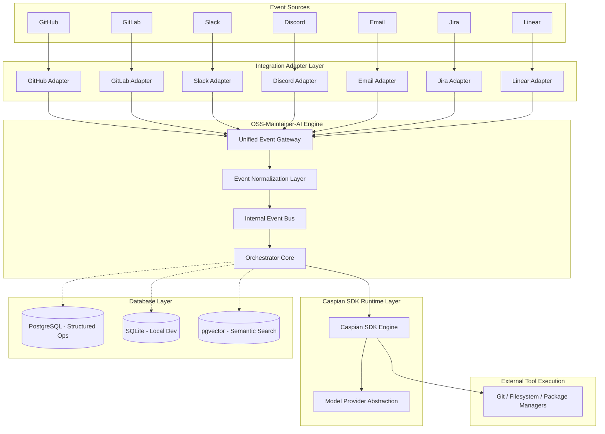
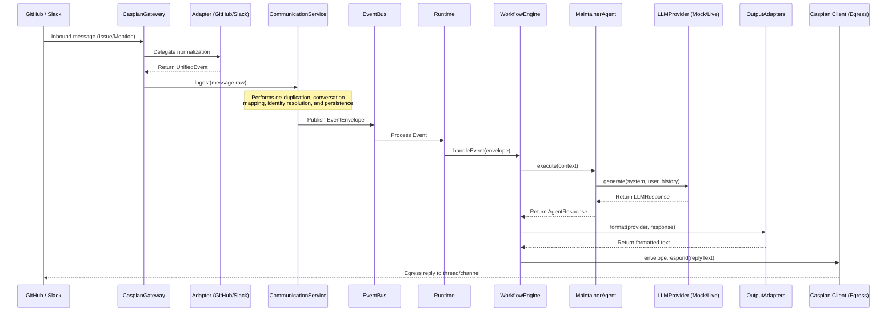
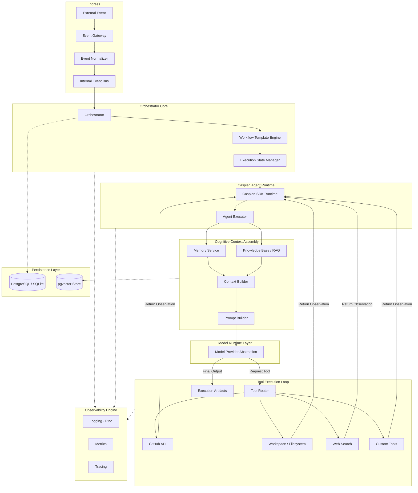

# OSS-Maintainer-AI

An autonomous, multi-platform AI co-maintainer built on top of the **Caspian SDK**.

---

## ⚡ Quick Start (5-Minute Zero-Config Demo)

Run a complete multi-channel agent execution loop locally without requiring any API keys:

```bash
# 1. Install dependencies
pnpm install

# 2. Copy the environment variables example
cp .env.example .env

# 3. Run the zero-config offline demo
pnpm demo
```

To run individual provider mocks:

- `pnpm demo:github` — replays a GitHub Issue thread.
- `pnpm demo:slack` — replays a Slack Mention thread.

---

## 🎯 Reviewer Q&A

### 1. What problem does OSS-Maintainer-AI solve?

Open-source maintainers face severe burnout triaging issues, managing onboarding friction, and answering repetitive questions across fragmented platforms (Slack, GitHub, Discord, Email). OSS-Maintainer-AI automates this by acting as a context-aware maintainer agent answering comments and triaging issues.

### 2. Why use Caspian?

Caspian provides a unified, secure messaging gateway. Instead of building webhook ingestion, polling loops, signature verification, and API clients for 10 different platforms, we write **one adapter per channel** that translates to/from Caspian format. Caspian coordinates real-time tunnels automatically, making multi-channel integrations trivial.

### 3. How does the architecture work?

We implement a decoupled **Runtime Execution Subsystem**. External platforms (Slack/GitHub) send events to the **CaspianGateway**, which normalizes them to a `UnifiedEvent`. The **CommunicationService** resolves conversation and identity threads in a local SQLite/Postgres DB, then publishes the event to the **EventBus**. The **WorkflowEngine** intercepts it, instantiates `AgentContext`, triggers `MaintainerAgent` execution via the `LLMProvider` contract, and posts replies back via `OutputAdapters` target routes.

### 4. How do I run the demo?

Follow the [⚡ Quick Start](#-quick-start-5-minute-zero-config-demo) section above, or see [DEMO.md](file:///c:/Users/branybuck/code/OSS-Maintainer/DEMO.md) for a detailed walkthrough script.

---

## Features

### Implemented (Current State)

- **Caspian Ingress**: Inbound messages arrive through the Caspian gateway in either polling or webhook mode, with HMAC signature verification and event de-duplication on the webhook path.
- **GitHub Channel**: Normalized into the Unified Event Model and answered on the same thread.
- **Slack Channel**: Normalized into the Unified Event Model and answered on the same thread/channels.
- **Integration Adapter Layer**: Channel-specific normalization lives entirely in `src/gateway/adapters/`; the orchestrator only ever sees unified events.
- **Agent Subsystem**: Decoupled registry, execution runtime container, LLM provider wrappers, prompt builder, and output response formatting adapters.
- **Scalable Data Schema**: Dialect-independent database schemas (PostgreSQL / SQLite) mapping versioned workflows, actors, executions, traces, and chunked vector embeddings.
- **Dual Dialect Client**: PostgreSQL connector using `pg` for production, and `better-sqlite3` for local development.
- **Trace Engine**: Structured tables capturing raw execution logs, observations, and tool parameters.
- **CI Validation**: Automated GitHub Action pipelines for formatting, linting, type-safety checks, and unit testing.

### Planned (Immediate Roadmap)

- **Memory & RAG Indexing**: Local Markdown file vector extraction using `pgvector` for semantic context search.
- **Additional Channels**: Discord, Email, Jira, and Teams integrations.

---

## Supported Providers

- [x] GitHub
- [x] Slack
- [ ] Discord
- [ ] Telegram
- [ ] Email
- [ ] Jira
- [ ] Linear
- [ ] Microsoft Teams

---

## Architecture

OSS-Maintainer-AI separates platform-specific integrations from core orchestration logic, relying on the **Caspian SDK** as its foundational runtime layer.

### High-Level System Architecture

This diagram illustrates how external platforms interact with the system and how the persistence layer acts as a backing datastore.



---

## End-to-End Workflow & Agent Execution

Both GitHub issues and Slack mentions travel through the exact same platform-independent communication pipeline, triggering agent workflows and rendering replies back to the originating threads:



---

### Internal Component Architecture

This diagram details the internal runtime execution loop, tracing how events flow through normalization, execution engines, agents, context construction, and tool router cycles.



---

### Component Responsibilities

1. **OSS-Maintainer-AI Core**: Responsible for defining workflow templates (`WorkflowTemplate`), managing versioned steps (`WorkflowVersion`), orchestrating execution run-states (`ExecutionState`), building user prompt templates, formatting outputs, and emitting telemetry metrics.
2. **Caspian SDK Runtime**: Manages the message polling loop and handles interaction loops between agent executors and LLM providers. It abstracts provider SDK schemas (OpenAI, Anthropic, Gemini) and resolves tools requested by models.
3. **Integration Isolation**: External communication channels and repository providers are isolated from the orchestrator runtime using the **Integration Adapter Layer**. Platform events are parsed into a normalized internal scheme before hitting the gateway. Adding GitLab or Jira requires writing a custom integration adapter without modifying the core orchestrator or memory layouts.
4. **Decoupled Context, Memory, & Knowledge**: Memory (session histories) and Knowledge Bases (indexed documents) are implemented as independent helper services. The `Context Builder` combines these nodes before passing them to the `Prompt Builder` for LLM compilation, preventing LLM provider dependencies from bleeding into storage layouts.

---

## Technology Stack

- **Caspian SDK**: Chosen as the communication broker. It abstracts away Slack, Discord, and Email API quirks into a single messaging interface.
- **TypeScript & Node.js (18+)**: Strongly-typed compiler environment for clean application design.
- **Drizzle ORM**: Declares type-safe SQL schemas with native vector mapping support.
- **PostgreSQL (with `pgvector`)**: Relational database storing metadata alongside high-dimension embeddings for semantic search.
- **SQLite (`better-sqlite3`)**: Zero-dependency database driver fallback for local testing.
- **pnpm**: Fast package dependency installation using hard links.
- **Vitest**: ESM-native test runner.
- **Pino**: High-performance JSON logger.
- **Zod**: Runtime environment schema validation on boot.

---

## Getting Started

### Prerequisites

- Node.js (v18+)
- pnpm (v11+)
- PostgreSQL (with `pgvector` extension) _or_ SQLite (local)

### Installation

```bash
# Clone the repository
git clone https://github.com/darkraider01/OSS-Maintainer-AI.git
cd OSS-Maintainer-AI

# Install dependencies
pnpm install
```

### Environment Configuration

Copy `.env.example` to `.env` and fill out your variables:

```bash
cp .env.example .env
```

### Database Migrations

Run the Drizzle migrations to set up your tables:

```bash
pnpm exec drizzle-kit push
```

### Connect the GitHub Channel

Provision the Caspian GitHub channel, then open the printed `authorize_url` to install the App
on your repositories:

```bash
pnpm run caspian:connect-github
```

See [docs/runbooks/caspian-github.md](docs/runbooks/caspian-github.md) for the full setup,
webhook configuration, and the end-to-end verification steps.

### Execution Commands

```bash
pnpm run dev                    # Run locally
pnpm run caspian:connect-github # Provision the Caspian GitHub channel
pnpm run build                  # Compile to JavaScript
pnpm run test                   # Run unit tests
pnpm run lint                   # Check code quality
pnpm run format:check           # Verify formatting
```

---

## Repository Structure

```
OSS-Maintainer-AI/
├── .github/                 # Workflows (CI, Security Audits) & PR/Issue templates
├── docs/                    # System Vision, Roadmap, and Architectural Decisions (ADRs)
├── src/
│   ├── cli/                 # Operator commands (channel provisioning)
│   ├── config/              # Environment parser, Logger setup, system constants
│   ├── db/                  # Drizzle database client & migrations
│   │   ├── schema/          # Split tables (actors, messages, executions, embeddings)
│   ├── domain/              # Persistence-independent core domain structures
│   ├── gateway/             # Caspian ingress, Unified Event Model, internal event bus
│   │   ├── adapters/        # Per-platform normalization (GitHub first)
│   │   └── caspian/         # SDK client, message builders, webhook signatures
│   ├── shared/              # Common helper routines
│   ├── core/                # Orchestration workflows & event handlers
│   ├── types/               # TypeScript compiler interfaces
│   └── index.ts             # Application entry point
├── tests/                   # Integration & unit tests
├── drizzle.config.ts        # Drizzle kit configuration file
└── package.json             # Core dependency manifest
```

---

## Roadmap

- [x] Repository Bootstrap
- [x] Persistence Layer (Drizzle + pgvector)
- [x] Caspian SDK Broker Integration
- [x] GitHub Integration
- [ ] Memory & RAG Indexing
- [ ] Issue Triage Agent
- [ ] PR Review Agent
- [ ] Multi-Agent Orchestration Workflows
- [ ] GitLab, Slack, and Discord Connectors

---

## Contributing

We welcome contributions! Please review our guides to get started:

- [CONTRIBUTING.md](CONTRIBUTING.md) — Git workflow and commit conventions.
- [CODE_OF_CONDUCT.md](CODE_OF_CONDUCT.md) — Pledge of inclusion.
- [SECURITY.md](SECURITY.md) — Vulnerability reporting policy.

---

## Built With

OSS-Maintainer-AI is an independent open-source project built using the [Caspian SDK](https://github.com/TryCaspian/caspian-sdk). We give special thanks to the TryCaspian team for creating and maintaining the SDK that powers this project's communication layer.

---

## License

Distributed under the [MIT License](LICENSE).
