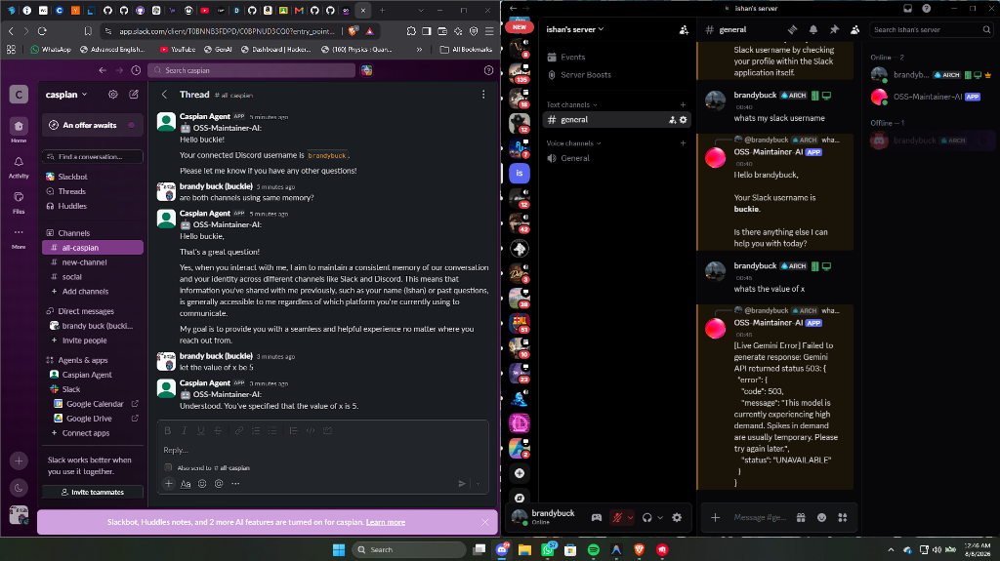
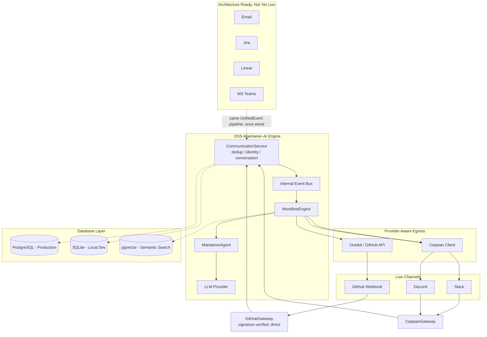
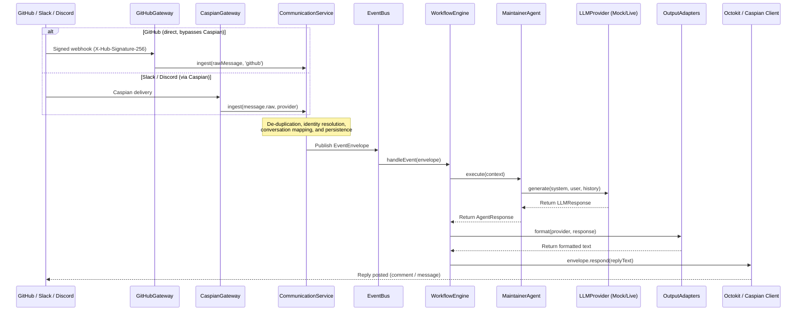

# OSS-Maintainer-AI

[](https://github.com/darkraider01/OSS-Maintainer-AI/actions/workflows/ci.yml)
[](https://github.com/darkraider01/OSS-Maintainer-AI/actions/workflows/security.yml)
[](LICENSE)
[](package.json)
[](tsconfig.json)
[](pnpm-workspace.yaml)

An autonomous, multi-platform AI co-maintainer built on top of the **Caspian SDK**.

---

## ⚡ Quick Start (5-Minute Zero-Config Demo)

Run a complete multi-channel agent execution loop locally without requiring any API keys:

```bash
# 1. Install dependencies
pnpm install

# 2. Copy the environment variables example
cp .env.example .env

# 3. Run the zero-config offline demo
pnpm demo
```

To run individual provider mocks:

- `pnpm demo:github` — replays a GitHub Issue thread.
- `pnpm demo:slack` — replays a Slack Mention thread.

---

## 🚀 Executive Summary (1-Minute Read)

### The Problem

Open-source maintainers face severe burnout. Triaging issues, responding to repetitive queries, and managing onboarding friction across multiple fragmented channels (Slack, Discord, GitHub, Email) eats up hours of productive coding time.

### The Solution: OSS-Maintainer-AI

OSS-Maintainer-AI is a platform-independent, context-aware co-maintainer agent that unifies these channels into a single execution stream. It acts as an automated assistant to maintain conversations, triage bug reports, and answer questions.

### Why Caspian Matters

Caspian acts as the unified communication backbone of the system. Instead of writing, configuring, and securing custom API clients, webhooks, signature verification logic, and polling loops for 10 different platforms, we write **one adapter per channel** that translates to/from Caspian format. Caspian coordinates real-time tunnels automatically.

### Why This is Different from a Normal Chatbot

Traditional chatbots are hardcoded to a specific chat API (e.g., Slackbot SDK) and lack unified cross-channel identity and context. OSS-Maintainer-AI unifies identity and context under a single database actor model:

- If you tell the bot your name on Slack, it remembers it when you message it on Discord.
- If you define custom variables (`x = 5`) on one channel, the context carries over to all other channels in real-time.

---

## 🖥️ Live Demo

The project has been demonstrated live on the following channels:

- **Slack**
- **Discord**
- **GitHub** — a real, direct GitHub App integration (see "🐙 GitHub Integration" below); it bypasses Caspian rather than going through it, since GitHub isn't a Caspian channel today.

Slack and Discord are connected **simultaneously** through Caspian and share:

- **One Communication Layer** to normalize message routing
- **One UnifiedEvent model** representing any incoming platform action
- **One Conversation Service** to manage and track thread sessions
- **One Identity Service** to merge cross-platform usernames into a single actor record
- **One Maintainer Agent** responding with consistent instructions
- **One memory/context pipeline** resolving cross-channel thread history

> [!NOTE]
> The screenshots in this repository demonstrate the exact same running maintainer agent instance responding on both Slack and Discord, recalling variables and context across platforms.



---

## 🔌 How Caspian Fits

Caspian is **not** simply another SDK dependency. It is the communication backbone that abstracts away the infrastructure of supported messaging platforms.

Instead of writing platform-specific ingress webhooks and client libraries, the flow unifies immediately:

```
Slack/Discord
     ↓
  Caspian
     ↓
Communication Layer
     ↓
  UnifiedEvent
     ↓
Maintainer Agent
```

This structural separation ensures that platform-specific API quirks, payload differences, and signature validation details are isolated at the edge, keeping the core agent logic entirely clean.

---

## 🐙 GitHub Integration

GitHub is not available as a Caspian channel in the public Caspian environment, so — unlike Slack and Discord — it doesn't route through Caspian at all. Instead, OSS-Maintainer-AI runs a **real, direct GitHub App integration**: a signed webhook straight into the same Communication Layer, and real replies posted back via the GitHub REST API (Octokit). It converges into the exact same `UnifiedEvent`, `MaintainerAgent`, and downstream pipeline Slack/Discord use — one AI maintainer, three adapters, not three bots.

### Architecture Diagram

```
                    OSS-Maintainer-AI

GitHub Webhook ───────────────┐
                               │
Slack ─────── Caspian ────────┤
                               │
Discord ───── Caspian ────────┤
                               ▼
                    Communication Layer
                               │
                               ▼
                         UnifiedEvent
                               │
                               ▼
               Conversation / Identity / Memory
                               │
                               ▼
                        MaintainerAgent
                               │
                               ▼
                          LLM + Tools
                               │
              ┌────────────────┴────────────────┐
              ▼                                 ▼
         GitHub API                          Caspian
        (Octokit, GitHub App)         (Slack / Discord)
```

### Ingress & Egress Routing

- **GitHub Ingress:** `GitHubGateway` (`src/gateway/github-gateway.ts`) verifies the `X-Hub-Signature-256` HMAC, reads `X-GitHub-Event`/`X-GitHub-Delivery`, and normalizes `issues.opened`, `issue_comment.created`, `pull_request.opened`, `pull_request_review.submitted`, and `pull_request_review_comment.created` (`src/gateway/adapters/github.ts`) into the same duck-typed message shape `CommunicationService.ingest()` already accepts from Slack/Discord.
- **Deduplication:** Reuses the existing `DeduplicationService`, keyed on `X-GitHub-Delivery` — no second dedup system.
- **Self-event protection:** Reuses `IdentityService.isSelfEvent()` — the GitHub App's own bot identity is seeded as `actors.type = 'bot'` at startup so the agent never replies to its own comments.
- **GitHub Egress:** The formatted `AgentResponse` goes through the existing `GitHubResponseAdapter`, then a GitHub App-authenticated Octokit client (`src/gateway/github/client.ts`) posts the comment — the `MaintainerAgent` never talks to GitHub directly.
- **Slack / Discord Ingress & Egress:** Unchanged — handled entirely through Caspian's unified connection broker.
- **Zero Platform Logic in the core:** Both ingress paths converge into the same `UnifiedEvent` pipeline before the agent ever sees them.

### Enabling it

```bash
GITHUB_ENABLED=true
GITHUB_APP_ID=...
GITHUB_APP_SLUG=...
GITHUB_PRIVATE_KEY=...
GITHUB_INSTALLATION_ID=...
GITHUB_WEBHOOK_SECRET=...
```

See [`.env.example`](.env.example) for the full list. Leave `GITHUB_ENABLED` unset (default `false`) and Slack/Discord/everything else starts exactly as before — GitHub is fully optional.

### Real end-to-end demo

This is a real integration, not a simulated one — running it live requires your own GitHub App, repository, and a public HTTPS tunnel:

1. `pnpm install && cp .env.example .env`, then `pnpm run dev` to start the app locally.
2. Expose it with a tunnel (e.g. `smee.io` or `ngrok http 3000`) so GitHub can reach `http://localhost:3000/webhooks/github`.
3. [Create a GitHub App](https://github.com/settings/apps/new): enable **Issues** and **Pull requests** read/write permissions, subscribe to the `Issues`, `Issue comment`, `Pull request`, `Pull request review`, and `Pull request review comment` webhook events, and set the webhook URL to your tunnel URL + `/webhooks/github` with a webhook secret.
4. Install the App on a test repository, note the **Installation ID** from the install URL.
5. Fill in `GITHUB_APP_ID`, `GITHUB_APP_SLUG`, `GITHUB_PRIVATE_KEY` (downloaded from the App settings), `GITHUB_INSTALLATION_ID`, `GITHUB_WEBHOOK_SECRET`, and `GITHUB_ENABLED=true` in `.env`, then restart the app.
6. Open a real Issue on the test repository.
7. Watch the terminal show the live pipeline:
   ```
   GitHub webhook received
   → signature verified
   → event normalized
   → conversation resolved
   → actor resolved
   → MaintainerAgent executing
   → LLM response generated
   → GitHub comment posted
   ```
8. The agent's reply appears as a real comment on the Issue.

---

## 🔗 Cross-Channel Identity Linking

Each provider identity is resolved independently — `IdentityService.resolveActor()` keys strictly on `(provider, providerUserId)`, so the same human commenting on GitHub and messaging on Discord gets two unrelated actor records by default, and the cross-channel memory `WorkflowEngine` already builds (recent history from _other_ conversations the same actor participated in) never bridges providers on its own.

To fix that, there's an optional account-linking dashboard: a human signs in with GitHub, Slack, and Discord, and every identity they authenticate with gets tied to one shared actor.

- **How it works:** visiting the dashboard with no session starts a "Sign in with X" OAuth flow for whichever provider you click first — that establishes the shared actor. Signing in with a second or third provider in the same browser session either attaches that identity to the actor, or, if it was already a separate actor from prior activity, **merges** the two: its other linked accounts and message history move over, and the leftover actor is deleted.
- **No passwords, no stored tokens.** Provider access tokens are used once, server-side, to fetch `(id, username, avatar)`, then discarded. The security property is the same one "Sign in with X" account-linking uses everywhere: a merge only happens when the same browser, holding a short-lived session cookie, completes a real OAuth round-trip for the account being linked.
- **Enable it:** set `AUTH_ENABLED=true` plus `AUTH_BASE_URL` and OAuth client id/secret pairs for GitHub, Slack, and Discord — see [`.env.example`](.env.example). It shares the same webhook HTTP server/port as the GitHub and Caspian routes; visit `<AUTH_BASE_URL>/dashboard`. Fully optional — everything else starts normally when it's left off.
- **Contributor history:** the dashboard also shows a small stats line per linked identity — messages sent (from the actor's own message history) plus, when `GITHUB_STATS_REPO=owner/repo` is set, issues opened and PRs opened in that repo (via the GitHub Search API). Degrades gracefully to message-count-only when GitHub isn't linked or configured.

---

## 📚 Documentation Ingestion Pipeline

`pnpm run ingest:docs owner/repo` pulls a repository's README and every `.md`/`.mdx`/`.txt` file under `/docs`, chunks each document on paragraph boundaries, embeds every chunk, and stores the result following the hierarchical schema already defined in [`docs/architecture/persistence.md`](docs/architecture/persistence.md): `knowledge_sources` → `documents` → `document_chunks` → `embeddings` (a real `pgvector` column in Postgres; JSON-serialized text in SQLite dev — same code, no dialect branching).

- **Idempotent:** each document's content is checksummed; unchanged documents are skipped entirely on re-runs (no re-chunk, no re-embed, no wasted API calls) — safe to run on a schedule or after every push.
- **Embeddings:** `MockLLMProvider` generates a deterministic fake vector (demo mode, tests — no API key needed); `LiveLLMProvider` calls Gemini's embedding endpoint with `outputDimensionality: 1536` to match the schema's fixed vector size.
- **Retrieval:** the agent actually queries these embeddings — general Q&A can call a real `search_documentation` LLM tool (Gemini function-calling) that does in-app cosine similarity over what this pipeline stored. See [Maintainer Workflows](docs/architecture/workflows.md) for how.
- Uses the same GitHub App client as the direct GitHub channel above. Works out of the box on public repos with the App's existing permissions; private repos may need **Contents: Read** added under the App's permissions if it fails with a 403.

---

## 🧠 Maintainer Workflows

Beyond answering questions, the agent handles four maintainer-specific
flows through one `MaintainerAgent` — no separate bot per workflow:

- **Issue Triage** — detects a bug report, asks for whatever's missing
  (repro steps, logs, SDK version, OS, environment), multi-turn. Never
  creates a GitHub issue automatically — it proposes one once complete and
  waits for a maintainer to confirm.
- **Contributor Onboarding** — detects "how do I start contributing?" and
  answers from the repo's real README/CONTRIBUTING.md/`good first issue`
  list, live. Says so explicitly if there's nothing to find, rather than
  inventing setup steps.
- **Human Escalation** — sensitive topics, repeated failure, or low
  classification confidence hand the conversation to a maintainer (real
  @-mention if one's configured) and the agent stops auto-replying on that
  thread until a human clears it.
- **PR Summaries** — auto-triggers when a PR opens, grounded in the actual
  changed-file diff: objective, changes, related issues, risks, review
  focus.

Full detail, including the routing diagram: [docs/architecture/workflows.md](docs/architecture/workflows.md).

### Nice-to-have features

Contributor Profiles (connected accounts, message history, onboarding
state — factual, not scored), Release Notes generation
(`pnpm run release-notes owner/repo`, categorized from real merged
PRs/closed issues), and Issue Analytics (`GET /analytics`, historical
escalation rate / time-to-first-response from the database) round out the
maintainer toolset. None of these gate the core workflows above.

---

## 🛡️ Production Readiness

- **Reliability** — bounded retry + circuit breaker on every external call
  (LLM, GitHub, Caspian), plus a durable retry queue so a reply that fails
  after in-process retries isn't lost, just delayed. [docs/architecture/reliability.md](docs/architecture/reliability.md)
- **Security** — webhook signature verification, rate limiting (per-IP at
  the HTTP edge, per-actor/per-conversation at ingestion), and an audited,
  test-enforced secret-hygiene policy. [docs/architecture/security.md](docs/architecture/security.md)
- **Observability** — structured logs correlated end to end, a
  `GET /metrics` Prometheus endpoint, and `GET /analytics` for historical
  issue/escalation numbers. [docs/architecture/observability.md](docs/architecture/observability.md)
- **Performance** — a repeatable load-test harness (`pnpm run load-test`)
  with measured throughput/latency clearly separated from targets and
  limitations — no unearned availability claims. [docs/performance/load-test-report.md](docs/performance/load-test-report.md)
- **Configuration** — every env var, grouped by feature, in one reference. [docs/configuration.md](docs/configuration.md)

---

## ⚡ Supported Providers

| Channel             | Status                | Details                                                                                                                                     |
| :------------------ | :-------------------- | :------------------------------------------------------------------------------------------------------------------------------------------ |
| **Slack**           | 🟢 Live               | Verified live and fully operational, via Caspian.                                                                                           |
| **Discord**         | 🟢 Live               | Verified live and fully operational, via Caspian.                                                                                           |
| **GitHub**          | 🟢 Live (Direct)      | Real GitHub App webhook ingress + Octokit egress — bypasses Caspian (not a Caspian channel today). Set `GITHUB_ENABLED=true` to turn it on. |
| **Email**           | 🟡 Architecture Ready | Adapter schema ready.                                                                                                                       |
| **Telegram**        | 🟡 Architecture Ready | Adapter schema ready.                                                                                                                       |
| **Jira**            | 🟡 Architecture Ready | Adapter schema ready.                                                                                                                       |
| **Linear**          | 🟡 Architecture Ready | Adapter schema ready.                                                                                                                       |
| **Microsoft Teams** | 🟡 Architecture Ready | Adapter schema ready.                                                                                                                       |

---

## 📐 High-Level Architecture

This diagram illustrates how platform events are normalized at the edge before entering the core agent workflow engine:



### End-to-End Workflow



---

## ⚖️ Why This Architecture Scales

Unifying communication under Caspian and the `UnifiedEvent` model creates an incredibly scalable codebase.

Adding a new communication provider (e.g., Teams or Jira) only requires:

1. **A provider adapter:** Normalizes the platform's incoming message JSON to a `UnifiedEvent`.
2. **Ingress wiring:** Registering the channel webhook path or polling loop.
3. **Egress wiring:** Adding formatting logic to format replies back to the channel.

The core cognitive engines—**Maintainer Agent, Workflow Engine, Memory pipeline, Conversation Service, Identity Service, and LLM Provider integration**—remain completely unchanged. This permits developers to scale channel reach without introducing code churn to the agent core.

---

## 🛠️ Getting Started

### Prerequisites

- Node.js (v22+)
- pnpm (v11+)
- PostgreSQL (with `pgvector`) or SQLite (default fallback for zero-config)

### Installation

```bash
# Clone the repository
git clone https://github.com/darkraider01/OSS-Maintainer-AI.git
cd OSS-Maintainer-AI

# Install dependencies
pnpm install
```

### Configuration & Migrations

1. Copy the environment template:
   ```bash
   cp .env.example .env
   ```
2. Apply the tracked migrations (Postgres):
   ```bash
   pnpm exec drizzle-kit migrate
   ```
   Running locally without `DATABASE_URL` set falls back to a zero-config SQLite file (`local_dev.db`), auto-migrated on first run — no separate step needed for the Quick Start demo above.

### Execution Commands

```bash
pnpm run dev                    # Run the live server locally
pnpm run caspian:connect-github # Provision GitHub as a Caspian channel (not used by the direct integration below)
pnpm run ingest:docs owner/repo # Embed a repo's docs for the search_documentation tool
pnpm run release-notes owner/repo --since=2026-01-01  # Generate categorized release notes
pnpm run load-test -- --conversations=1000 --concurrency=50  # Repeatable load-test harness
pnpm run build                  # Compile source code to JS
pnpm run test                   # Run unit tests
pnpm run lint                   # Check code style and linter errors
pnpm run typecheck              # Type-check without emitting
```

For the real, direct GitHub App integration (webhook ingress + Octokit egress, bypassing Caspian), see "🐙 GitHub Integration" above.

---

## 🤝 Contributing

We welcome contributions! Please review our guides to get started:

- [CONTRIBUTING.md](CONTRIBUTING.md) — Git workflow and commit conventions.
- [CODE_OF_CONDUCT.md](CODE_OF_CONDUCT.md) — Pledge of inclusion.
- [SECURITY.md](SECURITY.md) — Vulnerability reporting policy.

---

## 📄 License

Distributed under the [MIT License](LICENSE).
