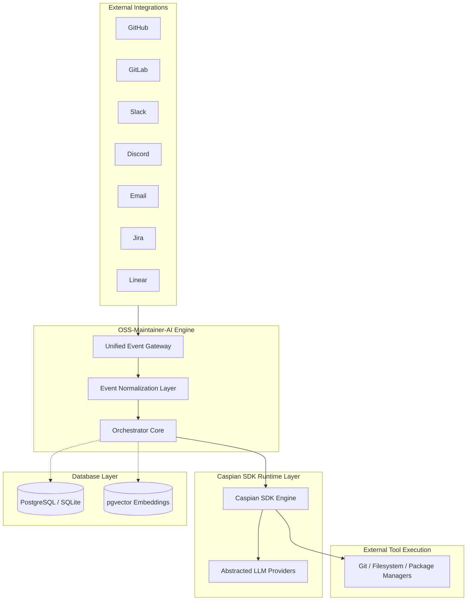
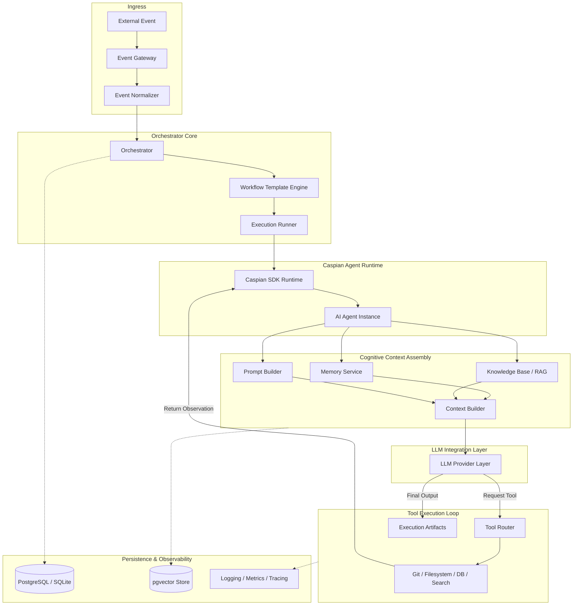

# OSS-Maintainer-AI

[](https://opensource.org/licenses/MIT)
[](https://www.typescriptlang.org/)
[](https://nodejs.org/)
[](https://github.com/darkraider01/OSS-Maintainer-AI/actions)
[](https://github.com/darkraider01/OSS-Maintainer-AI/issues)
[](https://github.com/darkraider01/OSS-Maintainer-AI/pulls)

An autonomous, multi-platform AI co-maintainer designed to automate workflows and assist open source project maintenance. Built on top of the Caspian SDK.

---

## Elevator Pitch

OSS-Maintainer-AI acts as a tireless background developer and curator for open-source repositories. By linking code review triggers, messaging interfaces, and execution environments into a unified workspace, it autonomously triages issues, reviews pull requests, runs lint check reports, answers contributor questions, and manages codebase knowledge. This mitigates maintainer burnout and keeps projects responsive.

---

## Why OSS-Maintainer-AI?

Open-source project success is often bottlenecked by human bandwidth:
* **Maintainer Burnout**: Repetitive issue triaging, checking code styles, and explaining basic issues consumes cognitive energy.
* **Contributor Onboarding Friction**: New contributors struggle with environment setup or local guidelines, causing delay.
* **Knowledge Fragmentation**: Design choices (ADRs), documentation, and past issues remain scattered, causing duplicate queries.

OSS-Maintainer-AI addresses these challenges by acting as a **context-aware agent** that runs local tools (compilers, git, test runners) to provide high-quality feedback, answer developer questions, and flag security issues before human review.

---

## Features

### Implemented (Current State)
* **Scalable Data Schema**: Dialect-independent database schemas (PostgreSQL / SQLite) mapping versioned workflows, actors, executions, traces, and chunked vector embeddings.
* **Dual Dialect Client**: PostgreSQL connector using `pg` for production, and `better-sqlite3` for local development.
* **Trace Engine**: Structured tables capturing raw execution logs, observations, and tool parameters.
* **CI Validation**: Automated GitHub Action pipelines for formatting, linting, type-safety checks, and unit testing.

### Planned (Immediate Roadmap)
* **Caspian SDK Integration**: Message loop bindings matching unified communication channels.
* **GitHub Integration**: Inbound webhooks parsing issue comments and pull requests.
* **Memory & RAG Indexing**: Local Markdown file vector extraction using `pgvector` for semantic context search.

---

## Architecture

OSS-Maintainer-AI separates platform-specific integrations from core orchestration logic, relying on the **Caspian SDK** as its foundational runtime layer.

### High-Level System Architecture

This diagram illustrates how external platforms interact with the system and how the persistence layer acts as a backing datastore.



---

### Internal Component Architecture

This diagram details the internal runtime execution loop, tracing how events flow through normalization, execution engines, agents, context construction, and tool router cycles.



---

### Component Responsibilities

1. **OSS-Maintainer-AI Responsibility**: Handles workflow state management, maps incoming normalized platform payloads to agent instances, coordinates memory retention policies, structures local workspace context, and formats output execution artifacts.
2. **Caspian SDK Responsibility**: Serves as the communication runtime engine. It abstracts platform API connection protocols (handling Slack webhooks, Discord connection streams, Email routing) into a single event stream and provides unified tool execution loops.
3. **Choice of Caspian SDK**: We use Caspian because it decouples agent intelligence from communication channel configurations. Adding support for a new platform (like GitLab or Jira) only requires adding a channel handler in Caspian without changes to the core orchestrator or memory layouts.
4. **Data Isolation**: Database models and RAG/vector components are kept strictly separated from execution orchestration code to allow easy migration, independent schema scaling, and dry-run tests.

---

## Technology Stack

* **Caspian SDK**: Chosen as the communication broker. It abstracts away Slack, Discord, and Email API quirks into a single messaging interface.
* **TypeScript & Node.js (18+)**: Strongly-typed compiler environment for clean application design.
* **Drizzle ORM**: Declares type-safe SQL schemas with native vector mapping support.
* **PostgreSQL (with `pgvector`)**: Relational database storing metadata alongside high-dimension embeddings for semantic search.
* **SQLite (`better-sqlite3`)**: Zero-dependency database driver fallback for local testing.
* **pnpm**: Fast package dependency installation using hard links.
* **Vitest**: ESM-native test runner.
* **Pino**: High-performance JSON logger.
* **Zod**: Runtime environment schema validation on boot.

---

## Getting Started

### Prerequisites
- Node.js (v18+)
- pnpm (v11+)
- PostgreSQL (with `pgvector` extension) *or* SQLite (local)

### Installation
```bash
# Clone the repository
git clone https://github.com/darkraider01/OSS-Maintainer-AI.git
cd OSS-Maintainer-AI

# Install dependencies
pnpm install
```

### Environment Configuration
Copy `.env.example` to `.env` and fill out your variables:
```bash
cp .env.example .env
```

### Database Migrations
Run the Drizzle migrations to set up your tables:
```bash
pnpm exec drizzle-kit push
```

### Execution Commands
```bash
pnpm run dev          # Run locally
pnpm run build        # Compile to JavaScript
pnpm run test         # Run unit tests
pnpm run lint         # Check code quality
pnpm run format:check # Verify formatting
```

---

## Repository Structure

```
OSS-Maintainer-AI/
├── .github/                 # Workflows (CI, Security Audits) & PR/Issue templates
├── docs/                    # System Vision, Roadmap, and Architectural Decisions (ADRs)
├── src/
│   ├── config/              # Environment parser, Logger setup, system constants
│   ├── db/                  # Drizzle database client & migrations
│   │   ├── schema/          # Split tables (actors, messages, executions, embeddings)
│   ├── domain/              # Persistence-independent core domain structures
│   ├── shared/              # Common helper routines
│   ├── core/                # Orchestration workflows
│   ├── types/               # TypeScript compiler interfaces
│   └── index.ts             # Application entry point
├── tests/                   # Integration & unit tests
├── drizzle.config.ts        # Drizzle kit configuration file
└── package.json             # Core dependency manifest
```

---

## Roadmap

- [x] Repository Bootstrap
- [x] Persistence Layer (Drizzle + pgvector)
- [ ] Caspian SDK Broker Integration
- [ ] GitHub Integration
- [ ] Memory & RAG Indexing
- [ ] Issue Triage Agent
- [ ] PR Review Agent
- [ ] Multi-Agent Orchestration Workflows
- [ ] GitLab, Slack, and Discord Connectors

---

## Contributing

We welcome contributions! Please review our guides to get started:
* [CONTRIBUTING.md](CONTRIBUTING.md) — Git workflow and commit conventions.
* [CODE_OF_CONDUCT.md](CODE_OF_CONDUCT.md) — Pledge of inclusion.
* [SECURITY.md](SECURITY.md) — Vulnerability reporting policy.

---

## Built With

OSS-Maintainer-AI is an independent open-source project built using the [Caspian SDK](https://github.com/TryCaspian/caspian-sdk). We give special thanks to the TryCaspian team for creating and maintaining the SDK that powers this project's communication layer.

---

## License

Distributed under the [MIT License](LICENSE).
