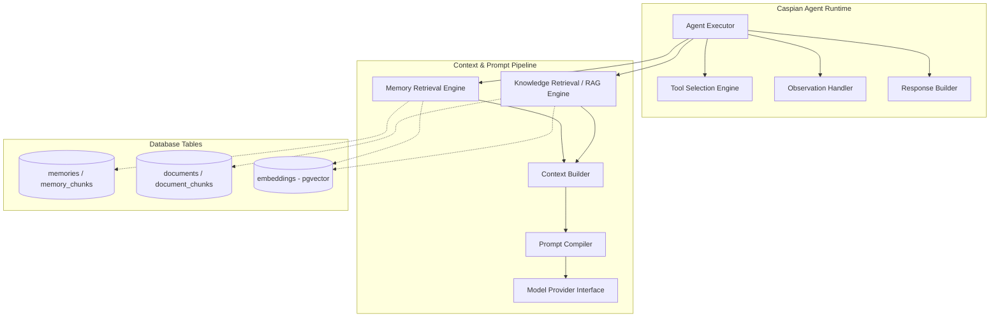

# C4 Level 3: Component Diagram

> **Note on accuracy:** this predates the actual workflow/tool implementation
> and describes a more generic "Tool Selection Engine"/"Memory Retrieval
> Engine using pgvector" design. What's real: `WorkflowRouter` dispatches to
> one of four concrete workflows (not a generic tool-selection loop —
> see [workflows.md](workflows.md)); the one real LLM tool
> (`search_documentation`) does in-app cosine similarity, not a pgvector
> query (see `workflows.md`'s "Why two doc-retrieval paths?"); conversation
> memory is a plain recent-messages SQL query, not vector search.

## Component Diagram

The Component diagram details the internal components of the **Caspian Agent Runtime** and the **Cognitive Context Assembly** pipelines.

---

## Component Responsibilities

- **Agent Executor**: Orchestrates execution state and manages retry policies.
- **Memory Retrieval Engine**: Fetches long-term and short-term session states, using vector distance checks via `pgvector`.
- **Knowledge Retrieval Engine**: Searches documents, checksum hashes, and markdown code chunks.
- **Context Builder**: Combines context histories and memory chunks into a structured structure.
- **Prompt Compiler**: Binds contexts to prompt files, injecting system properties.
- **Model Provider Interface**: Communicates with the model, converting output text back into structured tool requests or final answers.
- **Tool Selection Engine**: Resolves parameters requested by LLM provider outputs.
- **Observation Handler**: Formats terminal outcomes, file inputs, or API responses into text inputs for the next execution step.
- **Response Builder**: Formats the final answer into markdown or JSON artifacts.
