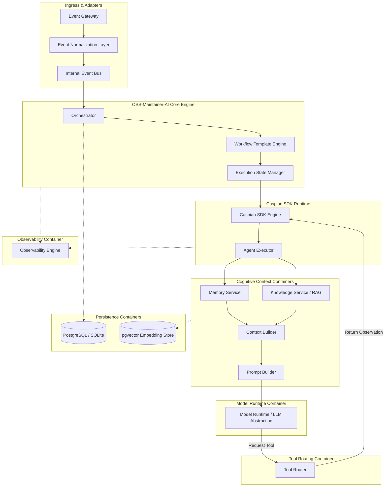

# C4 Level 2: Container Diagram

## System Container Diagram

The Container diagram details the runtime services and container boundaries that make up the **OSS-Maintainer-AI** project.

---

## Containers Breakdown

1.  **Event Gateway**: The API endpoint listening to webhooks and inputs.
2.  **Event Normalization Layer**: Formats provider payloads into a unified format.
3.  **Event Bus**: An in-memory queue that decouples ingest loops from orchestration execution.
4.  **Orchestrator**: Evaluates normalized events and coordinates templates.
5.  **Workflow Template Engine**: Resolves steps mapped in template configurations.
6.  **Execution State Manager**: Manages transaction runs, retry limits, checkpoints, and execution states.
7.  **Caspian SDK Engine**: Manages communication channels and loops.
8.  **Agent Executor**: Resolves the agent's logic run.
9.  **Memory & Knowledge Services**: Provide short-term and long-term context.
10. **Context & Prompt Builders**: Gathers context into a unified prompt layout.
11. **Model Runtime**: Abstracts LLM APIs.
12. **Tool Router**: Dynamic dispatcher triggering filesystem, search, or Git tools.
