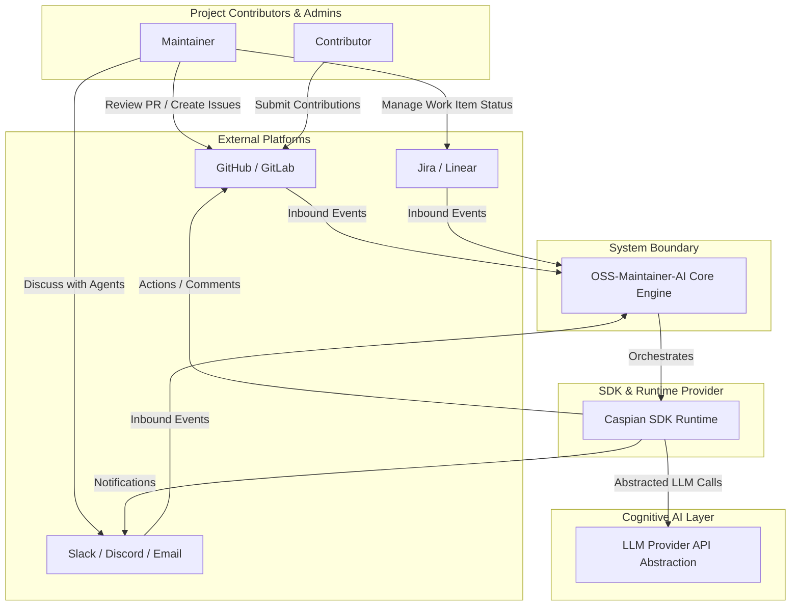

# C4 Level 1: System Context Diagram

## System Context Diagram

The System Context diagram illustrates the system boundaries, users (Maintainers, Contributors), integration targets (GitHub, GitLab, Slack, Discord, Jira, Linear), and external dependencies (Caspian SDK, LLM Providers).

---

## Boundaries & Scope

1.  **Maintainer & Contributor**: Standard users interacting with platforms.
2.  **External Platforms**: Input sources and target spaces where actions are executed.
3.  **OSS-Maintainer-AI**: The core orchestrator. It manages workflows, execution states, memories, and prompts. It has no direct knowledge of communication client details.
4.  **Caspian SDK**: The communication runtime layer. It normalize webhooks and implements tool routes.
5.  **LLM Providers**: External model hosting platforms (OpenAI, Anthropic, Gemini, Ollama, OpenRouter).
