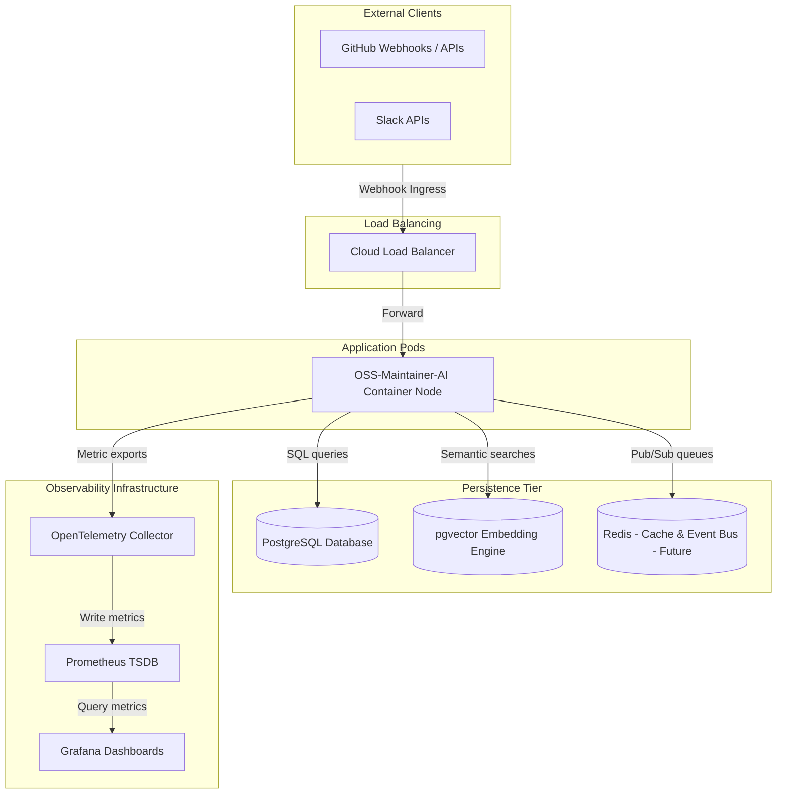

# Production Deployment & Infrastructure Topology

> **Note on accuracy:** the diagram below is the original target topology
> (Redis, an OpenTelemetry Collector, a standalone Prometheus + Grafana
> stack). None of that is deployed by this app itself today. What's real:
> a single Node process, Postgres (with pgvector) or SQLite, and a
> hand-rolled `GET /metrics` endpoint in Prometheus text format that an
> _external_ Prometheus server can scrape directly — see
> [observability.md](observability.md). No Redis, no event-bus process
> separate from the in-memory `EventBus` (`src/gateway/event-bus.ts`). Load
> characteristics actually measured against this current implementation are
> in [`docs/performance/load-test-report.md`](../performance/load-test-report.md).

## Deployment Diagram

The diagram below details the production deployment layout of **OSS-Maintainer-AI** on cloud infrastructure.

---

## Infrastructure Specifications

1.  **Application Container Nodes**: Node.js/TypeScript execution environments running the Caspian SDK.
2.  **PostgreSQL**: Handles operational tables (`actors`, `conversations`, `executions`).
3.  **pgvector**: High dimension vector mapping extensions enabled natively inside PostgreSQL database.
4.  **Redis (Optional Future Upgrade)**: Planned for shared event bus queuing.
5.  **OpenTelemetry Collector**: Handles trace pipelines, error profiling, and execution telemetry.
