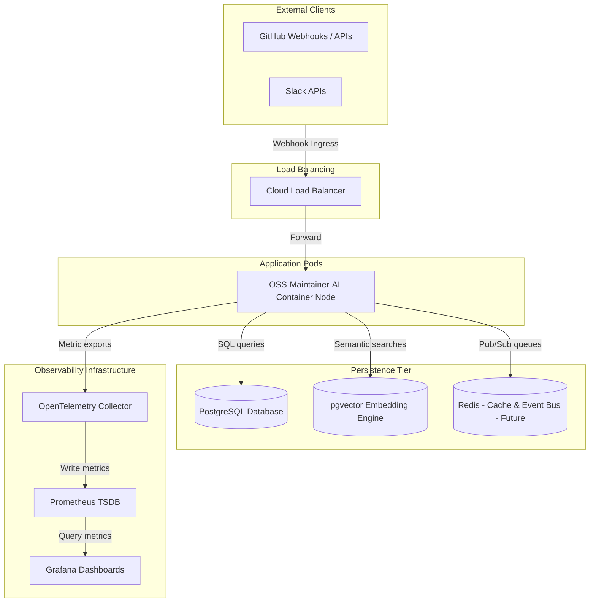

# Production Deployment & Infrastructure Topology

## Deployment Diagram

The diagram below details the production deployment layout of **OSS-Maintainer-AI** on cloud infrastructure.

---

## Infrastructure Specifications

1.  **Application Container Nodes**: Node.js/TypeScript execution environments running the Caspian SDK.
2.  **PostgreSQL**: Handles operational tables (`actors`, `conversations`, `executions`).
3.  **pgvector**: High dimension vector mapping extensions enabled natively inside PostgreSQL database.
4.  **Redis (Optional Future Upgrade)**: Planned for shared event bus queuing.
5.  **OpenTelemetry Collector**: Handles trace pipelines, error profiling, and execution telemetry.
