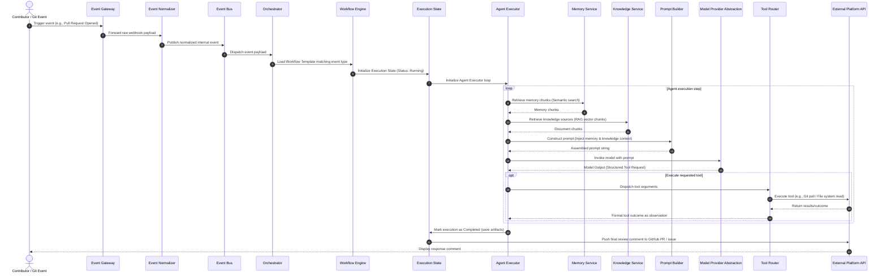

# Sequence Trace: Agent Execution

## Sequence Trace

The sequence diagram below traces the execution flow of an event from an external Git integration (e.g. GitHub Webhook) through normalization, orchestration, prompt compilation, LLM model invocation, tool routing, and response comments formatting.

