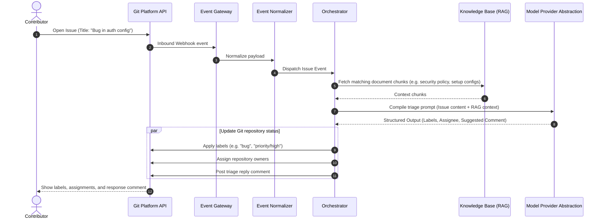

# Sequence Trace: Issue Triage

## Sequence Trace

The sequence diagram below maps the runtime stages when an issue is opened on a tracked repository:

```mermaid
sequenceDiagram
    autonumber
    actor Contributor as Contributor
    participant GH as Git Platform API
    participant GW as Event Gateway
    participant EN as Event Normalizer
    participant OR as Orchestrator
    participant RAG as Knowledge Base (RAG)
    participant LLM as Model Provider Abstraction

    Contributor->>GH: Open Issue (Title: "Bug in auth config")
    GH->>GW: Inbound Webhook event
    GW->>EN: Normalize payload
    EN->>OR: Dispatch Issue Event

    OR->>RAG: Fetch matching document chunks (e.g. security policy, setup configs)
    RAG-->>OR: Context chunks

    OR->>LLM: Compile triage prompt (Issue content + RAG context)
    LLM-->>OR: Structured Output (Labels, Assignee, Suggested Comment)

    par Update Git repository status
        OR->>GH: Apply labels (e.g. "bug", "priority/high")
        OR->>GH: Assign repository owners
        OR->>GH: Post triage reply comment
    end

    GH-->>Contributor: Show labels, assignments, and response comment
```
