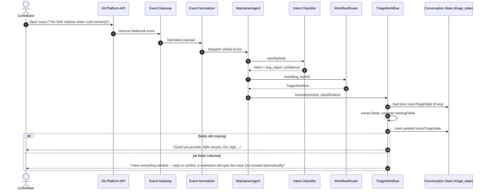

# Sequence Trace: Issue Triage

## Sequence Trace

Issue Triage (#18) never auto-labels, auto-assigns, or auto-creates a GitHub
issue. It collects the required fields (reproduction steps, logs, SDK
version, OS, environment details) across turns and only _proposes_ an issue
once complete — a maintainer confirms before any GitHub write happens (PRD
§7 / §21, "prefer confirmation before external side effects"). The sequence
below reflects that: intent classification and the WorkflowRouter dispatch
to `TriageWorkflow`, which runs structural (regex-based, not LLM-only) field
extraction against `IssueTriageState`, persisted per-conversation.

